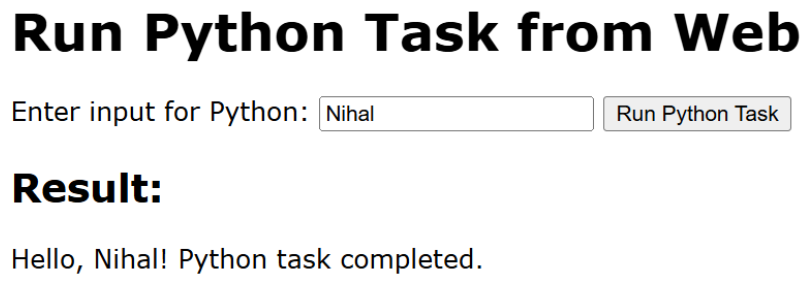
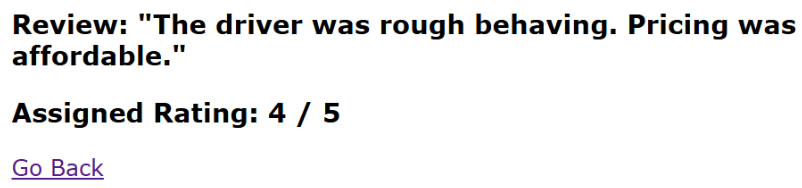
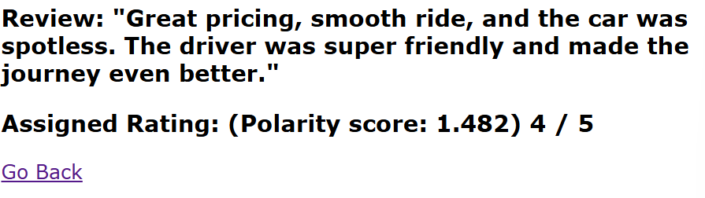
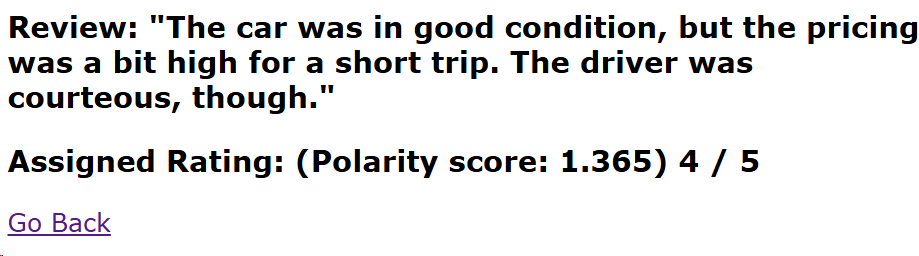

# Task Advancement

* Feb 4, 2025
	* Managed to export `.ipynb` file as `.py` file.
	* Managed to integrate python file inside a Node.js environment. `C:/Desktop/DemoNodePython`  
    

	* Managed to generate rating from single user review using a .py file on a NodeJS environment.
	

	* Managed to give textblob sentiment a new range [0, 2] instead of [-1, 1]
	* Figured out polarity score is the factor that decides rating
	* Incremented polarity score by 1; then divided the range in 5 areas: .4, .8, 1.2, .6, 2.0. Assigned them ratings from 1 to 5 based on which block those value fell into.
	* Added Polarity Score on the webpage
	* 